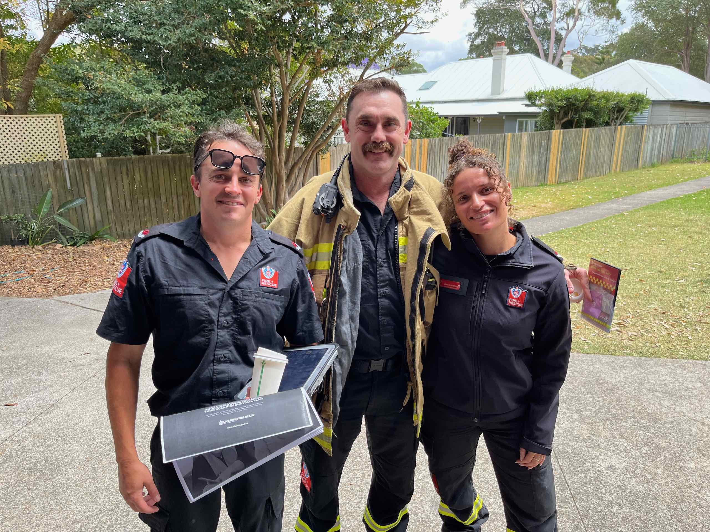
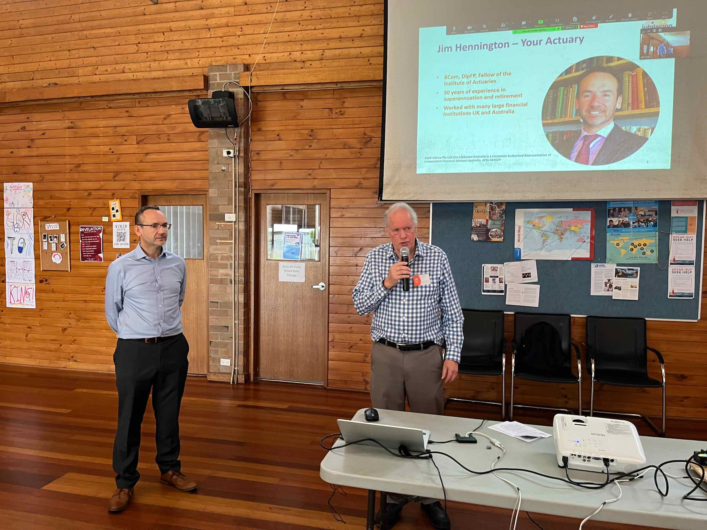

# November meeting Update from AIR Sydney Hills Branch

Our November meeting was held on Friday morning November 3rd 2023 at Beecroft Presbyterian Church Hall at10:30 for a 10:45 start with the Investors Discussion group following at 12:30pm after refreshments.

## 10:45am: Beecroft Fire Station – How to be ready for Fire Season

Our morning speakers were the firemen from the Beecroft Fire Station, who will show us How to be ready for Fire Season.

## 12:30pm: Introducing a new online retirement income planning service from Jubilacion

Jim Hennington (Actuary) from Jubilacion introduced their new online retirement income planning service. Using a real life case study, Jim showed us how to solve the big retirement questions including:

- How much savings do I need for retirement?
- How much can I spend each year in retirement?
- Will my savings run out before I do? and more…

## Meeting details

AIR Sydney Hills branch meets at 10:30 on the first Friday of the month, with our Investors Discussion Group meeting at 12:30. We use a Zoom connection for those unable to make it physically.

DISCLAIMER: While our speakers may be licensed Financial Advisors, this information does NOT constitute Personal Financial Advice.
