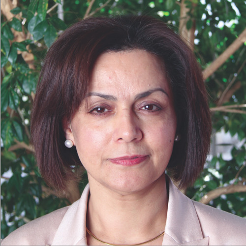

# March meeting Update from AIR Sydney Hills Branch

Our March meeting for 2024 was held on Friday morning March 1st 2024 at Beecroft Presbyterian Church Hall at 10:30 for a 10:45 start. The Investors Discussion group then followed at 12:30pm after refreshments.

## 10:45am: Diabetes Australia: Ways to prevent or live with Diabetes

Diabetes Australia Health Professional Vania Khoury led a general discussion on diabetes, the treatment options, exercises for those with diabetes and ways to help prevent it. A Q&A session followed.

## 12:30pm: Financial Literacy discussion by Robert Barnes, Superguide.com.au

Robert is the GM of Superguide.com.au, the most visited superannuation information website in Australia. Robert discussed how this service improves Financial Literacy about Superannuation. He covered How super works, Investing strategies, Retirement planning & Estate planning and more.

Robert also operates Pension Help Australia, helping people interact with Centrelink to obtain Age Pension and Commonwealth Seniors Heath Card benefits.

A Q&A session followed.

## Meeting details

AIR Sydney Hills branch meets at 10:30 on the first Friday of the month, with our Investors Discussion Group meeting at 12:30. We use a Zoom connection for those unable to make it physically.

DISCLAIMER: While our speakers may be licensed Financial Advisors, this information does NOT constitute Personal Financial Advice.
