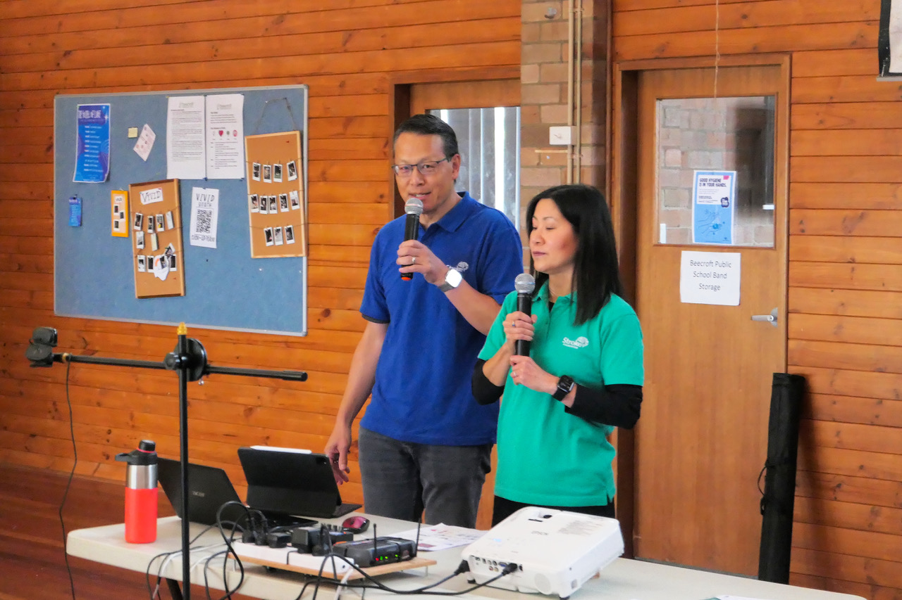
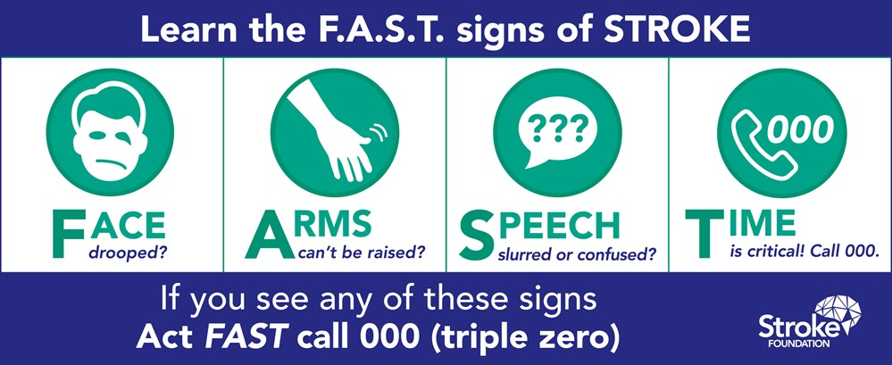
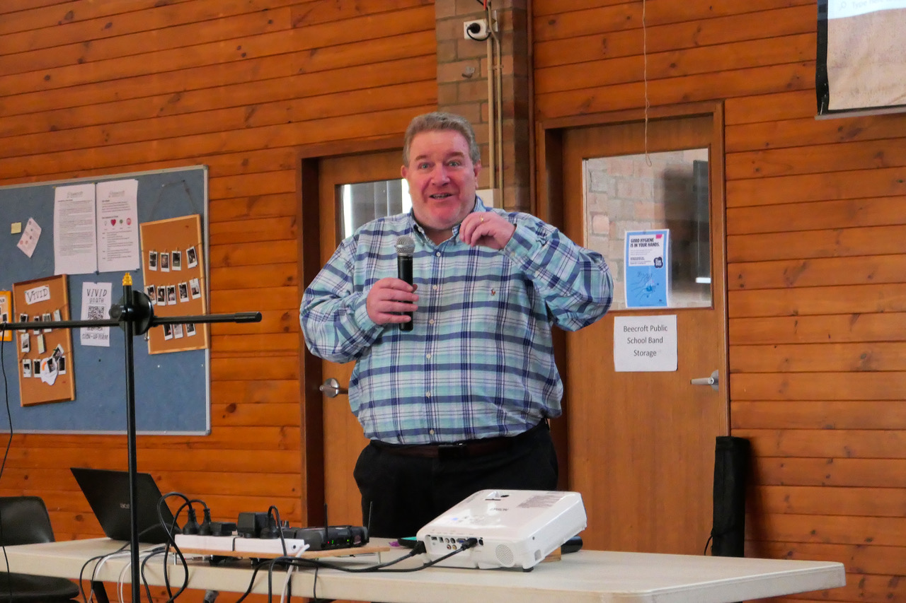

# May meeting Update from AIR Sydney Hills Branch

Our May meeting for 2024 was held on Friday morning May 3rd 2024 at Beecroft Presbyterian Church Hall at 10:30 for a 10:45 start. The Investors Discussion group followed at 12:30pm after refreshments.

## 10:45am: General meeting: Stroke Foundation: Acting FAST to save a life

Lillian Chen is a volunteer Stroke-Safe speaker for the Stroke Foundation, a retired pharmacist and also a Stroke survivor. She is passionate about increasing the awareness of stroke because by acting FAST everyone can save a life, and gave a presentation along with her husband, followed by a Q&A session.

The Stroke Foundation recommends the F.A.S.T. test as an easy way to remember the most common signs of stroke. Using the F.A.S.T. test involves asking these simple questions:

- **F**ace: Check their face. Has their mouth drooped?
- **A**rms: Can they lift both arms?
- **S**peech: Is their speech slurred? Do they understand you?
- **T**ime: Is critical. If you see any of these signs call 000 straight away.

## 12:30pm: Finance Discussion Group: Liam Shorte's End of Financial Year check list

Liam Shorte was back by popular demand, educating us on financial & superannuation changes. Liam gave us his insights into getting your SMSF in order for the End of Financial Year. Liam discussed the background and strategies to deal with the new Division 296 Tax requirements. A Q&A session followed based on member questions.

## Meeting details

AIR Sydney Hills branch meets at 10:30 on the first Friday of the month, with our Investors Discussion Group meeting at 12:30. We use a Zoom connection for those unable to make it physically.

DISCLAIMER: While our speakers may be licensed Financial Advisors, this information does NOT constitute Personal Financial Advice.
