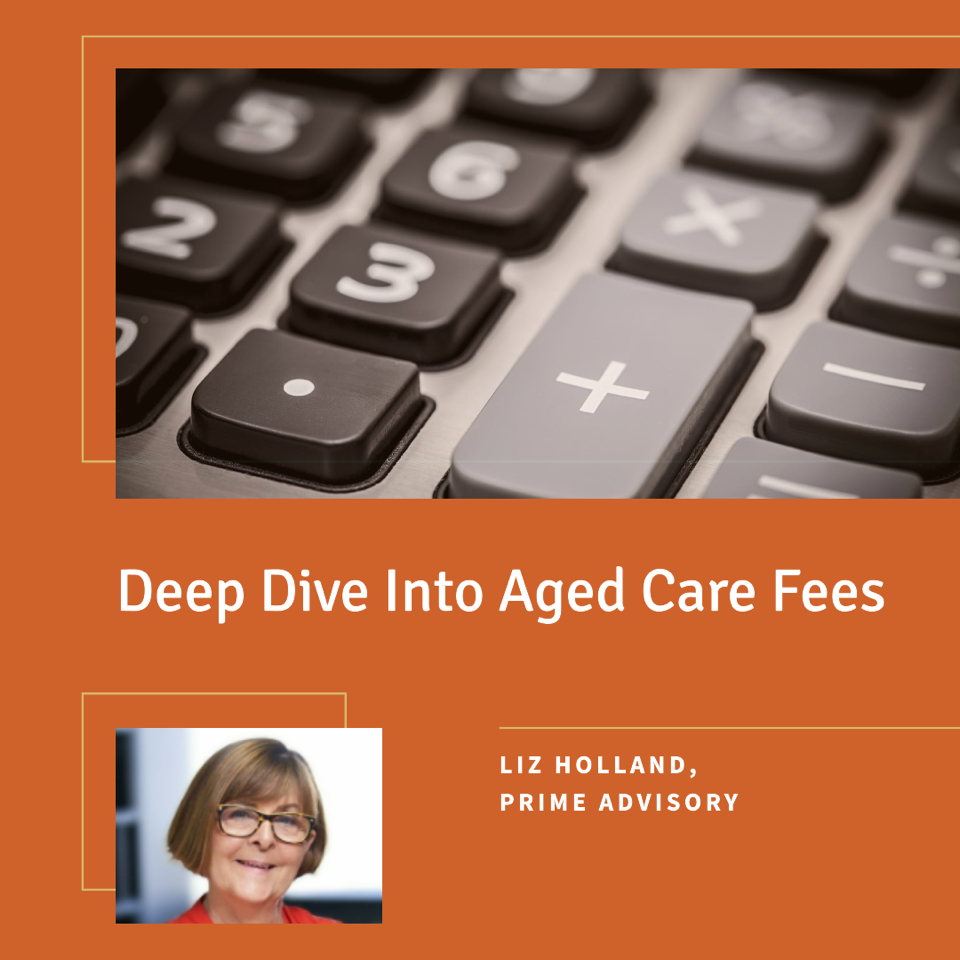

# June meeting Update from AIR Sydney Hills Branch

Our next meeting for 2024 will be held on Friday morning June 7th 2024 at Beecroft Presbyterian Church Hall at 10:30 for a 10:45 start. The Investors Discussion group will follow at 12:30pm after refreshments.

## 10:45am: Deep Dive on Aged Care Fees by Liz Holland, Aged Care Financial Advisor (Prime Advisory)

The Federal government has said that 'wealthy' retirees will pay more for aged/home care but have not defined who is wealthy & how much they will pay. Retirees are very concerned.

Liz will describe in detail how the aged care fees and charges work, including means testing of income and assets, the family home implications & how the various fees are worked out. Information on government funding, aged care provider billing and future plans to phase out Refundable Accommodation Deposits will also be provided. A Q&A session will follow

## 12:30pm: Round table to discuss our position on Aged Care costs

The federal government has said that more funding is required to improve the quality of aged care. In addition to higher co-contributions from self-funded retirees, the government will need to increase tax revenue to fund better aged care.

AIR intends to suggest some possible revenue options to the government and needs member input via a round-table branch discussion group meeting. 

## Meeting details

AIR Sydney Hills branch meets at 10:30 on the first Friday of the month, with our Investors Discussion Group meeting at 12:30. We use a Zoom connection for those unable to make it physically.

DISCLAIMER: While our speakers may be licensed Financial Advisors, this information does NOT constitute Personal Financial Advice.
