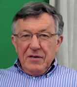
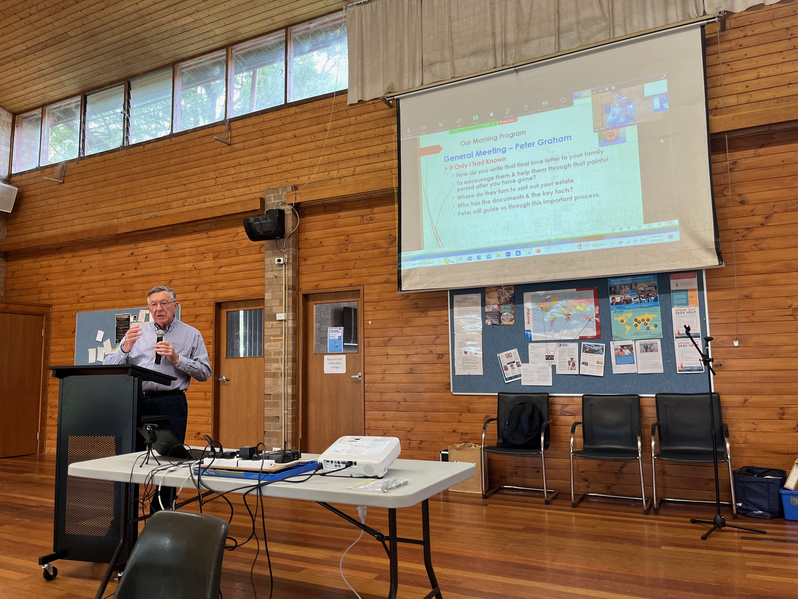
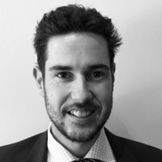
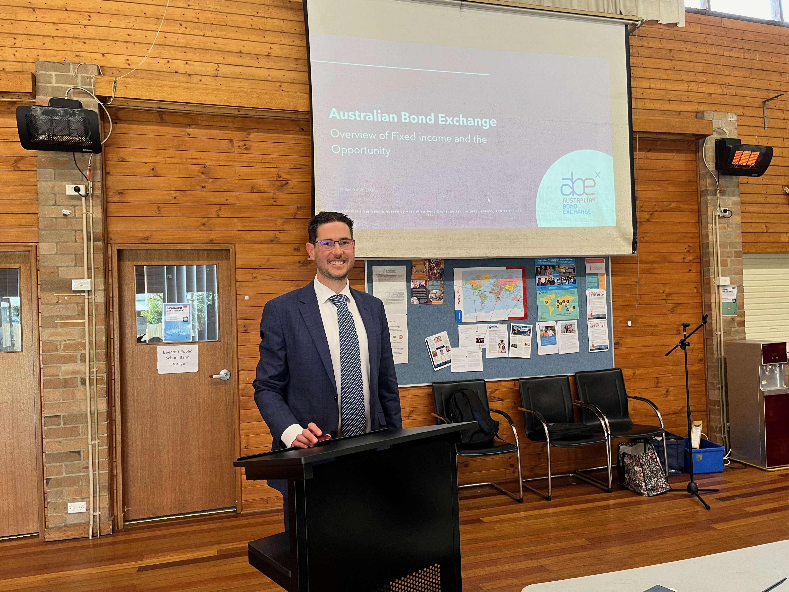

# July meeting Update from AIR Sydney Hills Branch

Our July meeting for 2024 was held on Friday morning July 5th 2024 at Beecroft Presbyterian Church Hall at 10:30 for a 10:45 start. The Investors Discussion group followed at 12:30pm after refreshments.

## 10:45am: If Only I had Known. Peter Graham- Retirement Coach & AIR Hills member

How do you write that final love letter to your family, to encourage them & help them through that painful period after you have gone? Not only that but where do they turn to sort out your estate & who has the documents & the key facts? Peter guided us through this important process.

A Q&A session followed

## 12:30pm: July Financial Meeting - Blair Dewhurst from Australian Bond Exchange

With higher interest rates prevailing in the market, fixed Interest returns have continued to be strong. Blair Dewhurst from Australian Bond Exchange (AIR National Sponsor) provided an update of the Bond market, current bond investment strategies and selection of recent offerings. Q&A session followed.

## Meeting details

AIR Sydney Hills branch meets at 10:30 on the first Friday of the month, with our Investors Discussion Group meeting at 12:30. We use a Zoom connection for those unable to make it physically.

DISCLAIMER: While our speakers may be licensed Financial Advisors, this information does NOT constitute Personal Financial Advice.
