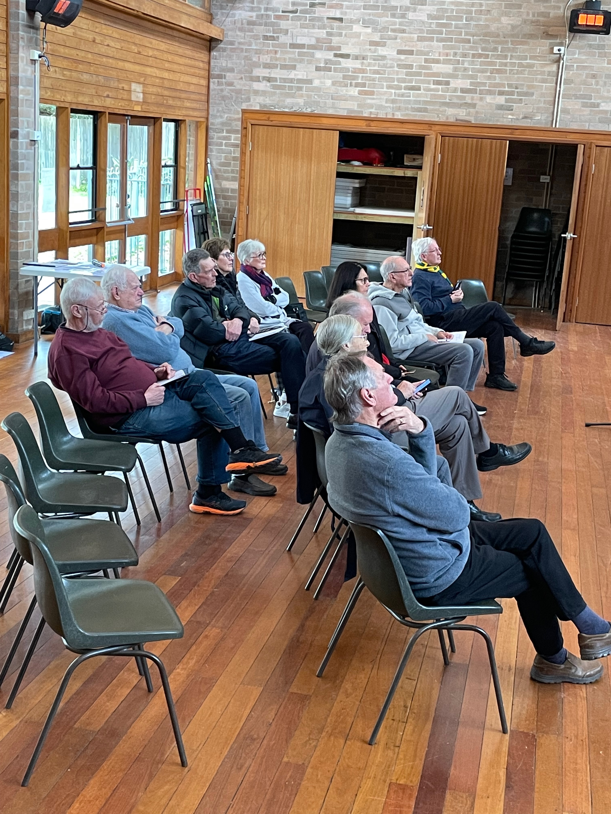

# August meeting Update from AIR Sydney Hills Branch

Our August meeting was held on Friday morning August 2nd 2024 at Beecroft Presbyterian Church Hall at 10:30 for a 10:45 start.
After the first speaker we held the Sydney Hills AGM. Some important information is about this follows below.
The Investors Discussion group will follow at 12:30pm after refreshments.  We have Zoom links below if you can’t attend personally.

## 10:45am: Living Well with Parkinsons. Christine McGee Educator

Christine McGee, the education coordinator for Parkinson’s NSW, will run an information morning on Living Well with Parkinsons. There will be particular attention to the practical aspects of care. A Q&A session will follow

## 12:30pm: Active & Passive Investing.(Part 1)- Listed Investment Companies & Trusts

Ian Irvine CEO of the Listed Investment Companies and Trusts Association will outline how listed investment companies and trusts can enable both active and passive investments and how they operate.

## Meeting details

AIR Sydney Hills branch meets at 10:30 on the first Friday of the month, with our Investors Discussion Group meeting at 12:30. We use a Zoom connection for those unable to make it physically.

DISCLAIMER: While our speakers may be licensed Financial Advisors, this information does NOT constitute Personal Financial Advice.
