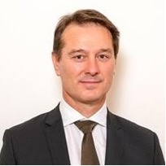

# September meeting Update from AIR Sydney Hills Branch

Our September meeting for 2024 was held on Friday morning September 6th 2024 at Beecroft Presbyterian Church Hall at 10:30 for a 10:45 start.
The Investors presentation followed at 12:30pm after refreshments.

## 10:45am: Finding purpose in retirement

Our members shared their experiences on the theme of Finding a purpose in retirement. Visitors are very welcome to come and share or learn during the discussion. Topics included:

- Fulfilling a dream
- What do you do with your spare time
- Volunteering
- Finding friendships in retirement
- Training your grandchildren
- Cost of living tips & hacks
- Unusual travel experiences/great places to visit

A yummy morning tea followed the meeting.

## 12:30pm: Active and Passive Investment with Exchange Traded Funds (ETFs) with David Bassanese, Chief Economist at Betashares.

David shared his insights into investing with ETFs using Active and Passive investment strategies. As a well-known economic commentator, David will also share his thoughts on the outlook for interest rates, inflation and other economic indicators in Australia.
Question and Answer session followed.
