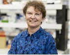

# November meeting Update from AIR Sydney Hills Branch

Our November meeting for 2024 was held on Friday morning November 1st 2024 at Beecroft Presbyterian Church Hall at 10:30 for a 10:45 start.
The Investors Discussion group followed at 12:30pm after refreshments.

## 10:45am: Living Well with Parkinsons. Christine McGee Educator

Christine McGee, the education coordinator for Parkinson’s NSW, ran an information morning on Living Well with Parkinsons. There was particular attention to the practical aspects of care. A Q&A session followed

## 12:30pm: Financial discussion group – Digital Financial Advice

With the forecast retirement wave, we know that demand for retirement and financial advice will increase significantly. Digital advice offers the potential to upscale retirement financial advice where face-to-face interaction is unavailable or unaffordable. Wayne Strandquist and the discussion group explored the possible scope, capabilities and benefits of digital financial advice.
