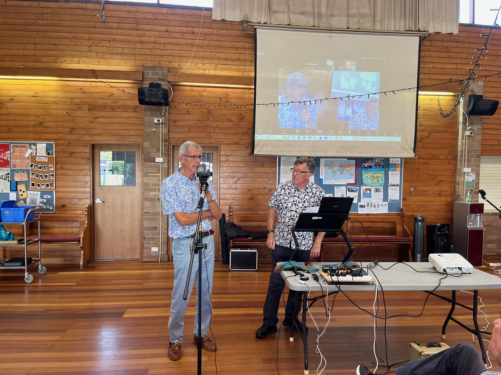
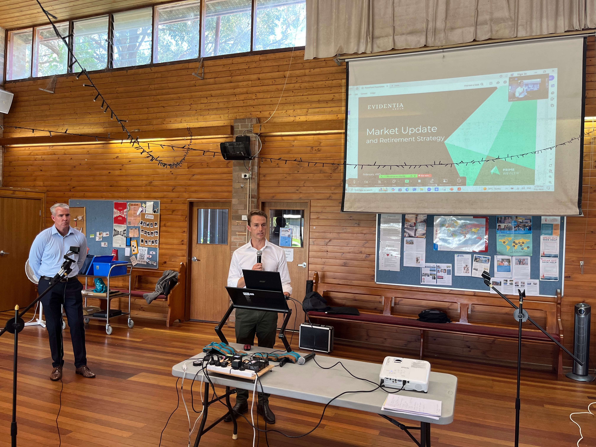

Our first meeting for 2025 was held on Friday morning February 7th 2025 at Beecroft Presbyterian Church Hall at 10:30 for a 10:45 start.

The Investors Discussion group followed at 12:30pm after refreshments.

### 10:45am: Social Contribution. Your way to wellbeing. Peter Carritt- Volunteer

Peter Carritt, a volunteer to families in need, showed us how Social Contribution can be a great way to help the community and also improve your own happiness & wellbeing. Members took the opportunity to share their experience & benefits.

### 12:30pm: Financial discussion group – 2025 Economic & Investment Outlook

Angus Rodgers (ranked in the top 1% of financial advisers in Australia) from Prime Advisory on Sydney’s North Shore and a member from his investment committee shared their insights on the economic and investment outlook for 2025. They will also describe how they utilise a range of investment portfolios to support the varied requirements of their clients.

