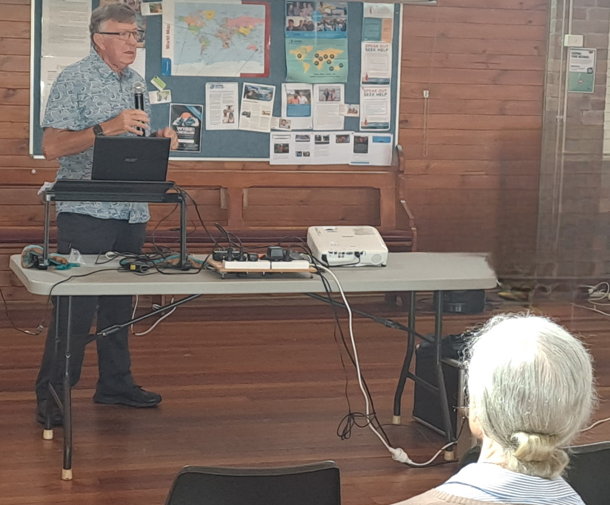

### 10:00am: The value of emerging friendships in avoiding loneliness as we age.  Peter Graham, retirement coach.

Peter Graham spoke from the heart about the epidemic of loneliness in old age. Peter described the 5 main types of friendships and how to identify and cultivate  emerging friendships & where to find them. There was great interaction with the audience and feedback from their personal experiences.

### 11:30am: Customer Service at Large Super Funds

Wayne Strandquist lead a discussion with our Financial Group on a range of customer service, account management, claim processing issues at large superannuation funds. He spoke about how you can escalate unsatisfactory service, delays in payments, pension updates, etc with AFCA, a govt Regulator almost unknown to most retirees. Many  experiences were shared  in the session.

