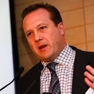
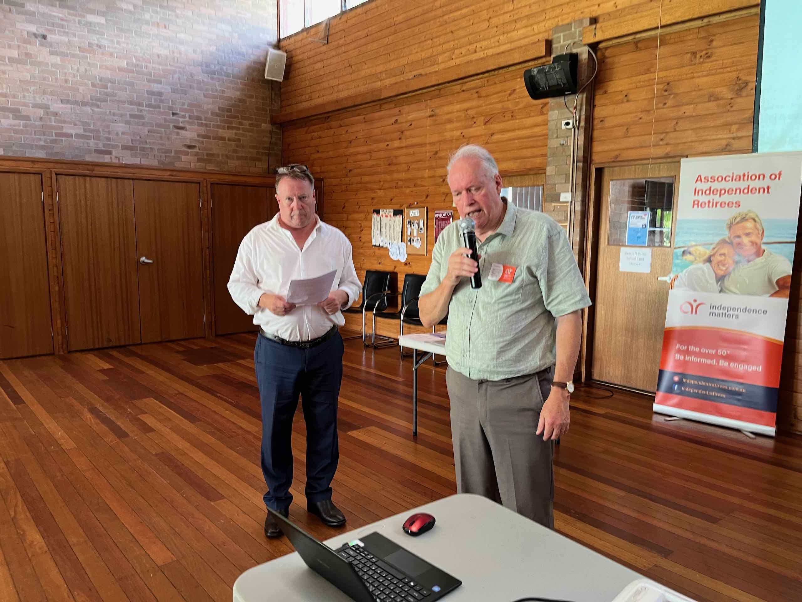

import Gallery from '../../components/gallery.astro'

# February meeting Update from AIR Sydney Hills Branch

Our first meeting for 2024 was held on Friday morning February 2nd 2024 at Beecroft Presbyterian Church Hall at 10:30 for a 10:45 start with the Investors Discussion group following at 12:30pm after refreshments.

## 10:45am: Central Coast seniors debunk the myths and outline the real benefits of Electric Cars

Margaret McDonald and Hugh Sykes met each other through their mutual love for Electric Vehicles (EV), and they both had so much in common they ended up marrying each other in June 2022, a year after they met. The couple are passionate about the potential for EVs to have a positive impact on climate change, and they gave a talk about these benefits and debunked myths about electric vehicles.

import img1 from '../../assets/images/2024-02-ev-1.webp'
import img2 from '../../assets/images/2024-02-ev-2.jpg'
import img3 from '../../assets/images/2024-02-ev-3.webp'
import img4 from '../../assets/images/2024-02-ev-4.webp'
import img5 from '../../assets/images/2024-02-ev-5.jpeg'
import img6 from '../../assets/images/2024-02-ev-6.jpeg'
import img7 from '../../assets/images/2024-02-ev-7.jpeg'

<Gallery images={[img1, img2, img3, img4, img5, img6, img7]} />

For more information, please refer to the following links:

- https://www.abc.net.au/listen/programs/lifematters/retired-newlyweds-celebrate-electric-romance/101333748
- https://www.abc.net.au/news/2022-07-20/electric-vehicle-romance-leads-to-myth-busting-talks-to-seniors/101233122
- https://9now.nine.com.au/today/videos/latest/love-of-electric-cars-sparks-romance-between-retirees/cl5vlj9ac00090jpd5xn824c6

## 12:30pm: Patrick Clarke (GM) from GenerationLife will describe their innovative retirement products that help navigate retirement with confidence

GenerationLife offers one of only a handful of available Lifetime Investment-linked Income stream products. LifeIncome is designed to:

- Complement income from a Superannuation Account Based Pension
- Potentially provide access to the Age Pension and related concessions
- Have the option for your spouse to receive a death benefit income

## Meeting details

AIR Sydney Hills branch meets at 10:30 on the first Friday of the month, with our Investors Discussion Group meeting at 12:30. We use a Zoom connection for those unable to make it physically.

DISCLAIMER: While our speakers may be licensed Financial Advisors, this information does NOT constitute Personal Financial Advice.
