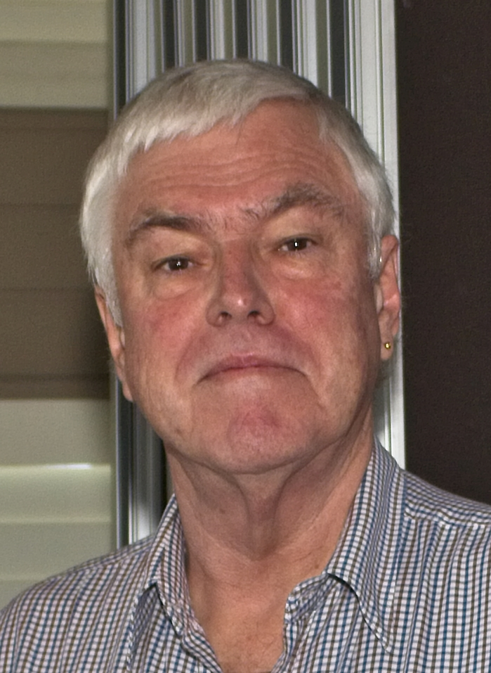
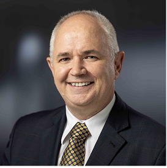

Our July meeting will be held on **special date of Friday July 11th 2025** at our new meeting location at Cheltenham Recreation Club’s **Mollys Bistro** at 10:00 am. 

The Investors Discussion group will follow at 11:30am after refreshments.

### 10:00am: Robert Allison – How to trace your Family History.

Robert is a member and volunteer at the Hornsby Shire Family History Group and will teach us...

##### **Branch News & a delicious morning tea will follow this talk.**

### 11:30am: Aaron Minney: Managing multiple sources of retirement income including lifetime pensions by income layering

Our speaker is **Mr Aaron Minney**, Head of Retirement Income Research at **Challenger**. Most active retirees who are relying on Account Based Pensions from Superannuation are concerned about increasing longevity and *potentially running out of retirement savings*. Aaron’s presentation is aimed at giving AIR members a better idea of the financial implications of longevity risk and **have some strategies** to get the most out of their retirement.

***Please note that this information does NOT constitute Personal Financial Advice.***

**We will finish around 12:30pm for a light lunch at Molly's.**
