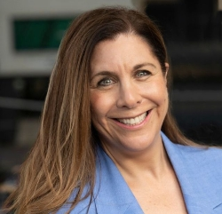

Our next meeting will be held on Friday April 4th 2025 at Beecroft Presbyterian Church Hall at the **new time** 10:00 am.

The Investors Discussion group will follow at 11:30am after refreshments.

### 10:00am: Danielle Robertson: Finding the right Aged Care solution.

With 38 years experience, Danielle has identified a serious gap in meeting the unique requirements of people in need of Aged Care. Danielle now specialises in matching people all over Australia with the care facility they need.

##### **Branch News & a delicious morning tea will follow Danielle's talk**

### 11:30am: Financial group – The key challenges for SMSF's in 2025

AIR’s **Self-Managed Super Fund Interest group** receive excellent monthly newsletters created by senior journalists Jason Spits & Darin Tyson-Chan. Today Jason will talk us through the upcoming changes to SMSFs, including the transfer balance cap, plus contributions & withdrawals changes. 

ATO changes to minimum pension drawdowns and subsequent problems are discussed, as well as the new amnesty to exit legacy pensions. Jason will also discuss an important ruling about the status of wholesale investors and update us on the status of the proposed Division 296 tax.  

Preference is given to questions emailed in advance to airsydneyhills@gmail.com. Questions have already been asked about when is a good time to wind-up an SMSF and rollover to an APRA fund?

Please talk to Jason about our SMSF newsletter and other projects to educate our members.
