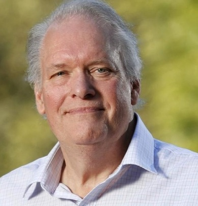

Our November meeting will be held on **Friday November 7th 2025** at our new meeting location at Cheltenham Recreation Club’s **Mollys Bistro** at 10:00 am.

This month, Blair Dewhurst from the Australian Bond exchange has some  information on how the Bond market is changing and offering new opportunities to build a stable income, followed by the Financial discussion group, who will share experiences in downsizing and how it can positively impact your finances and super. at 11:30am, after refreshments.

### 10:00am: Mr Blair Dewhurst, Aust. Bond Exchange. Fixed Income-building stability for retirement.

Blair will explain how bonds and other debt securities can form part of a diversified investment portfolio to deliver regular income in retirement. He will show how with structured maturity dates across a bond portfolio, investors can release capital to navigate varied economic environments. Find out why investors would choose to hold debt securities directly rather than in a bond fund or ETF and the differences between debt securities and other asset classes like shares and property.

##### **Branch News & a delicious morning tea will follow this talk.**

### 11:30am: : Finance Discussion Group Meeting- Downsizing: A financial perspective.

We have heard in previous talks about the many lifestyle benefits of downsizing our family home. In this discussion, Wayne will highlight the financial benefits that can be achieved through downsizing to a lower cost home in retirement. This includes contributions to superannuation and private savings with the potential to boost your retirement income.

***Please note that this information does NOT constitute Personal Financial Advice.***

**We will finish around 12:30pm. Please stay & enjoy a yummy lunch at Molly's.**
